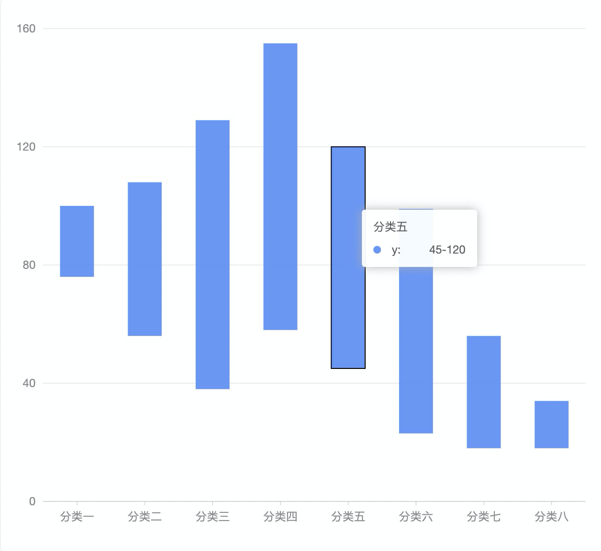
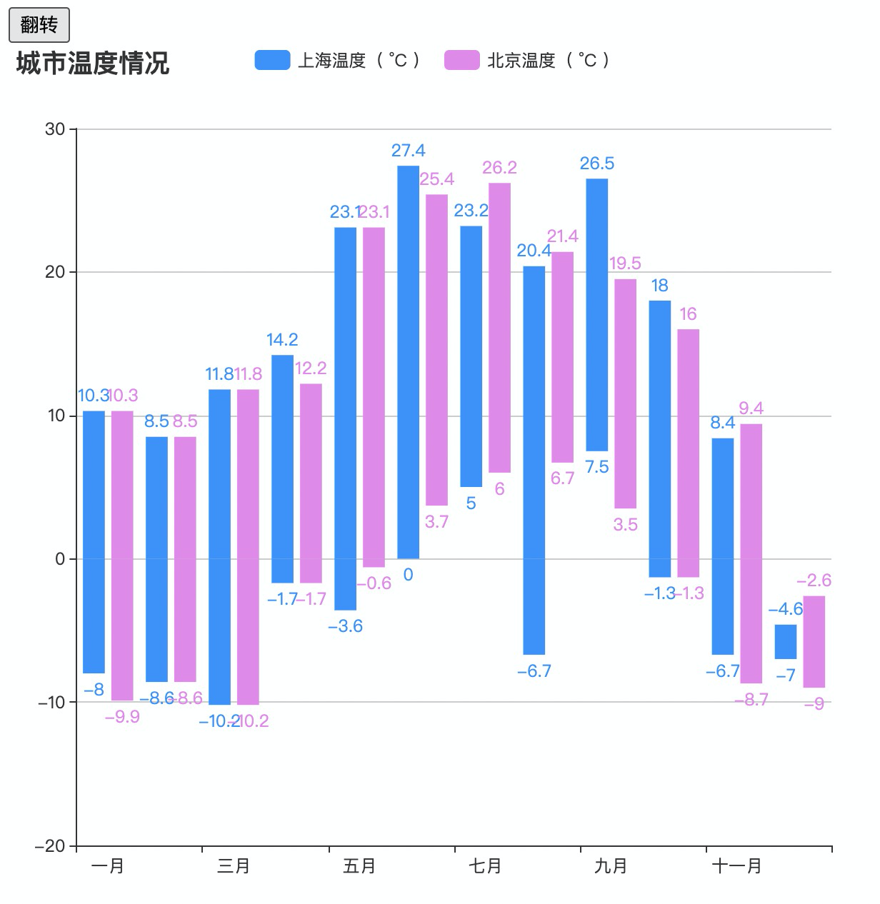
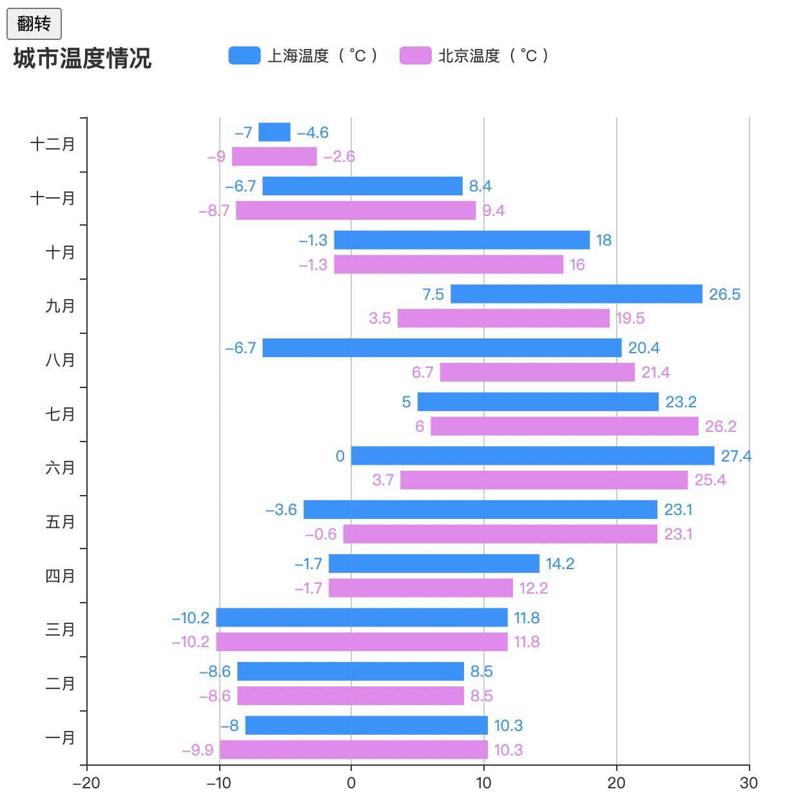
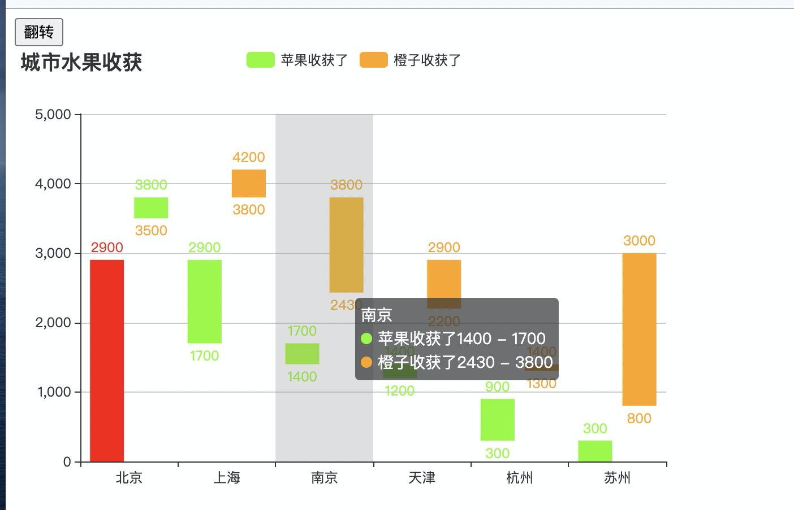
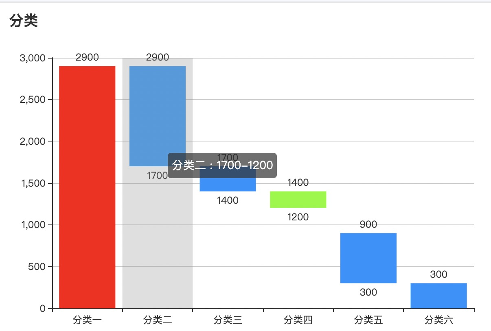
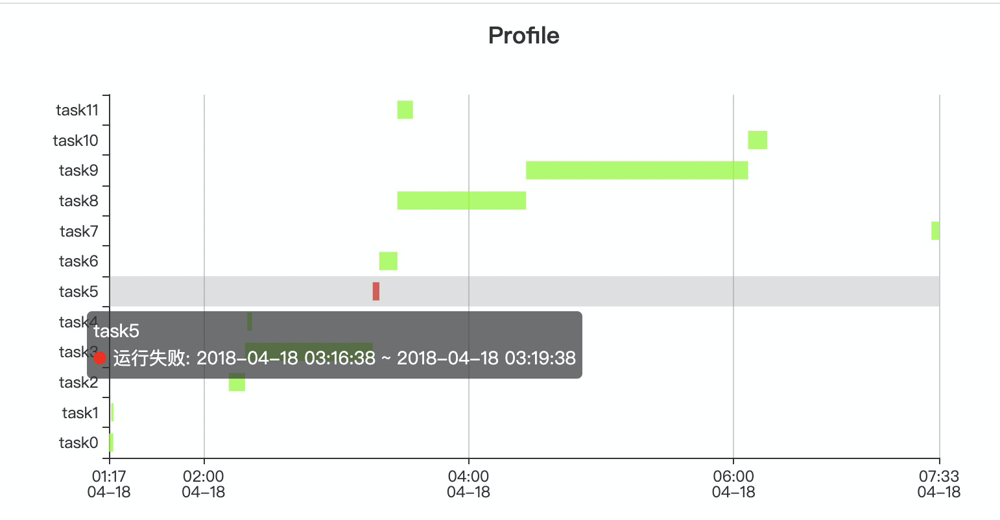

[TOC]

# 如何基于 echarts 实现区间柱状图（包括横向）？

> 始终如一

## 需求

需要利用 echarts 实现区间柱状图，效果如下：

效果来源于：[g2-柱状图](https://g2.antv.vision/zh/examples/column/basic#ranged)

## 借鉴 echarts 的 demo

1. [柱状图-深圳月最低生活费组成](https://echarts.apache.org/examples/zh/editor.html?c=bar-waterfall)
2. [柱状图-阶梯瀑布图](https://echarts.apache.org/examples/zh/editor.html?c=bar-waterfall2)

**demo 区间实现思路（视觉欺骗）**

1. 通过 bar 的 series 的 **`stack`** （堆叠）属性，实现柱子堆叠。
2. 再通过 bar 的 series 的 itemStyle 设置作为辅助的柱子隐藏（透明度为 0）。

**demo 不满足的点**

1. bar 的 label 显示：未区间
2. bar 的 tooltip 显示：未区间
3. 不支持多数据项

## 最终实现思路

1. 通过 bar 的 series 的 **`stack`** （堆叠）属性，实现柱子堆叠。
2. 通过 bar 的 series 的 itemStyle 设置作为辅助的柱子隐藏（透明度为 0）。
3. 通过 bar 的 series 的 markPoint 用于显示区间范围的最小值。
4. 通过将区间数据放入 data, 处理 tooltip 显示区间数值。
5. 考虑到区间[负值，正值]的情况，需要再利用 series 的一个 item 来显示负值的部分。

### 实现效果

1. 基于最终思路实现效果

2. 最终思路缩减版-没处理负值的效果，即没有最终实现思路的第 5 步

3. 基础思路实现 - 利用一个新的 series item 的 label 显示区间范围的最小值。

4. name + 值为时间 - 利用 `type: custom` 自定义实现效果

## 遇到的问题：

1. bar stack 堆叠属性 遇上 轴 `type："time"` 时会失效，因此有了 **其他方案实现2** 探索
2. 提供的区间数据含 **负值** 时，也会异常，无法正常显示负值的柱子（需要再特殊处理）。如温度区间，效果来源[highcharts-columnrange](https://www.highcharts.com/demo/columnrange)

## 代码映射

1. 最终思路实现：demo1-bar-range-negative.html
2. 最终思路缩减版实现：demo1-bar-range-optimize.html
3. 基础思路实现：demo1-bar-range.html
4. name + 值为时间：demo2-custom-range-status.html

## 最后

有更好思路或想法的，请联系我，非常欢迎找我探讨哟（✨🌜）。