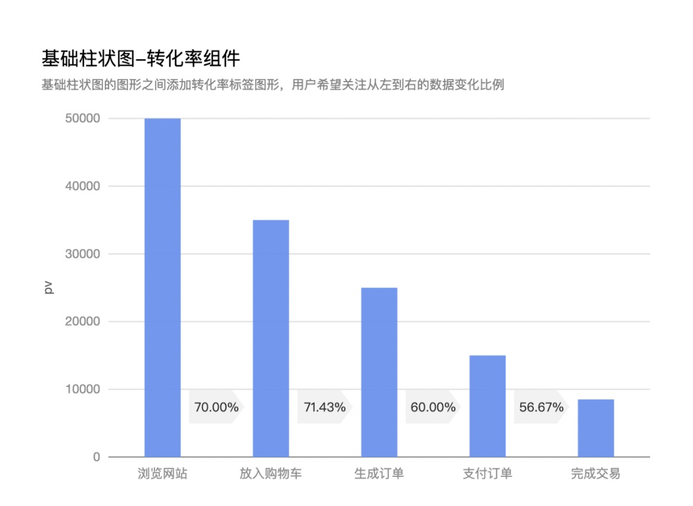
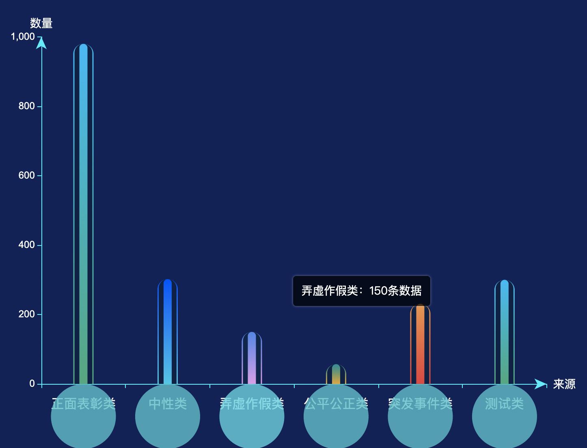
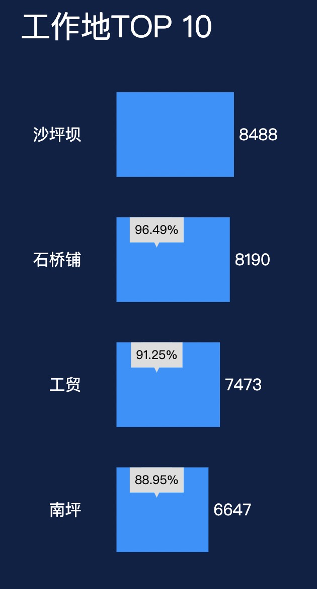
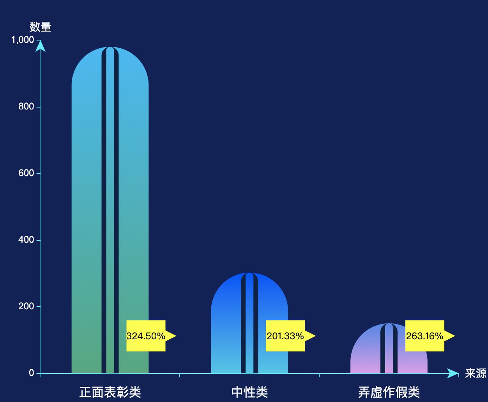
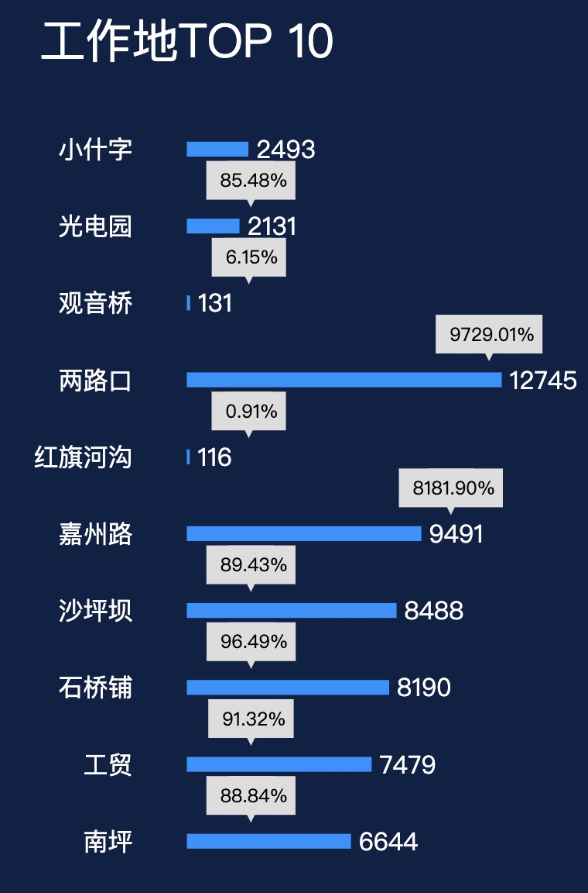
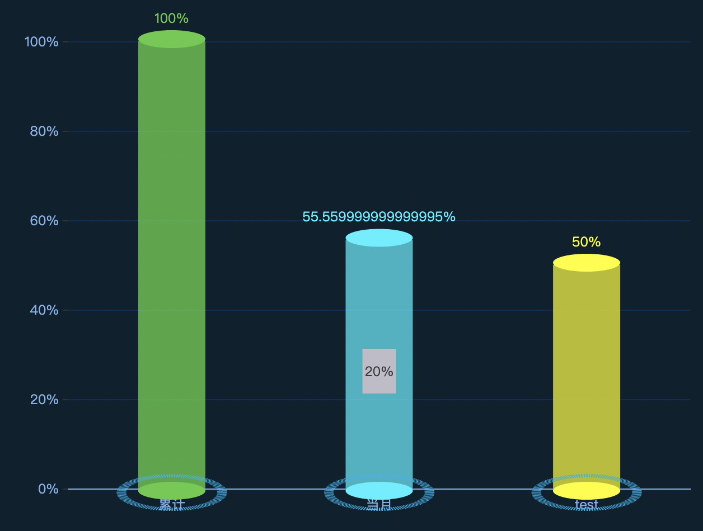
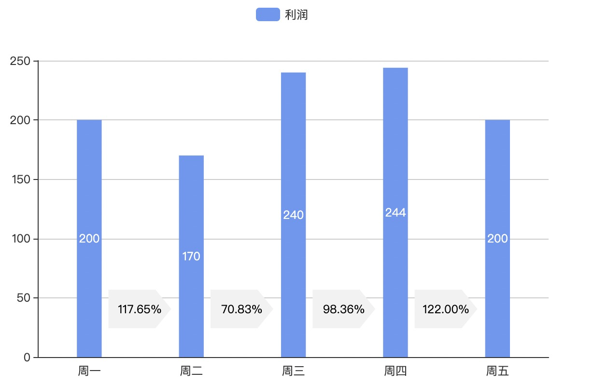
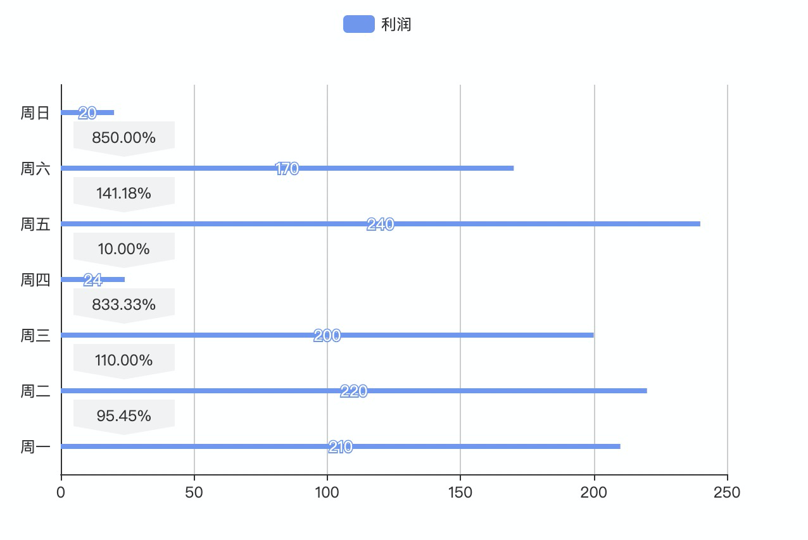
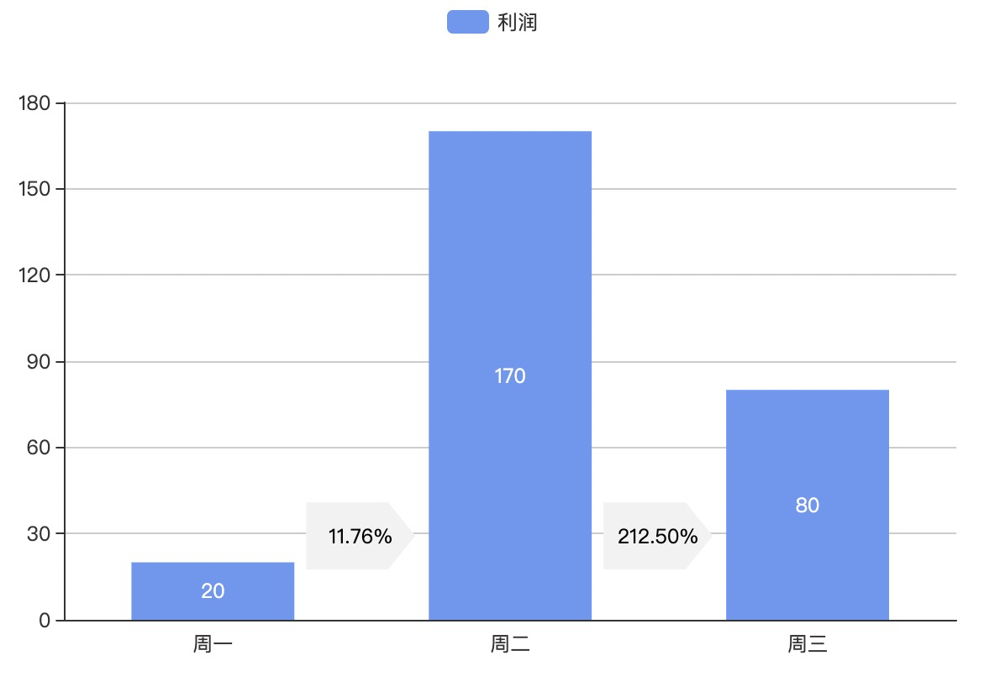

[TOC]

# 如何基于 echarts 在柱状图或条形图上实现转换率？（有想法吗？）

> 我是没想法啦（一开始）。其实，好久没接触 echarts 了，至少有一年多了，想起以前折腾地图的情景了🙃。

## 需求

两张图。没有再多了...

柱状图：

条形图：

## 探索一

俗话说，不知道怎么办的时候，百度来帮忙。百度一下。

输入关键字：echarts 柱状图 转换率


打开第一篇的结果：[echarts实现漏斗转化率图表效果](https://www.cnblogs.com/caihe/p/5945223.html)

文章描述的就是我想要的✌️。用的 series 中的markpoint 来实现。

找到思路了，找到 echarts 官网相关文档：[series-bar.markPoint](https://echarts.apache.org/zh/option.html#series-bar.markPoint)

看遍并动手操作了，结果是不能解决需求。原因如下：

1. 图形（箭头）：默认提供的没有满足的。[symbol]
2. 图形（箭头）位置：无法设置在两根柱子的中间，且距离轴固定距离。提供的可调整位置的参数都是针对当前柱子而言相对或绝对的距离。[symbolOffset 等位置参数]
3. 图形（箭头）百分比：如何拿到参数计算两根柱子直接的百分比。

一开始就被难倒了呢。不放弃，💪。

经过以上，对 markPoint 有了解了，并且也对需求要实现的点更清楚了。

百度/谷歌的结果，仅此一种思路。

## 探索二

那么如何解决呢，找类似案例，寻找思路。案例在哪呢？官网案例上没有类似的呢。

其实有个 echarts 的案例宝库：[gallery](https://gallery.echartsjs.com/explore.html#sort=rank~timeframe=all~author=all)，上面有非常丰富且有创意的案例。

寻找中...

可借鉴案例(最终用到的，其实还看了更多呢):
1. case1: [工作地top10](https://gallery.echartsjs.com/editor.html?c=xAFYsB3sA4)，借鉴地方：条形图，右侧圆，更改形状、位置等

2. case2: [温度计柱状图](https://gallery.echartsjs.com/editor.html?c=xUhUlij0j)，借鉴地方：柱状图，底部圆，更改形状、位置等

3. case3: [立体柱状图](https://gallery.echartsjs.com/editor.html?c=x0ou4zifid)，借鉴地方：柱状图，目标值，柱子中间问题解决了，只需改形状

4. case4: [柱形图排名](https://gallery.echartsjs.com/editor.html?c=xc_zUKnqQO)，借鉴地方：没看到可借鉴地方，猜想可能有用就留着了，后面其实帮大忙了


## 探索三

案例收集好了，那么开始吧，通过观察案例，寻找思路，探索可行性，并进行实践。

### 转换实践思路1

case1, cas2 是实现思路是一样的，只是方向不一样。都是基于 series，用其中一项作为圆，type: scatter，通过改变相关属性来实现的。

由于之前看到 symbol 支持三角形，想到个思路，箭头可以用三角形和矩形绘制而成。


看了结果，是不是很接近需求了，可以采用了。

答案是否定的。

- 失败

因素：增加了数据项


因为位置是相对柱子而言的，并不能准确的保证在柱子中间。可能改的位置不对😑


因素：更改了数据项的值

因为比例有大小，而值会根据坐标轴定位


只能放弃了。

### 转换实践思路2

case3 是用 series 的 标注线实现的。


堪称很完美了，还有动画呢。

至于形状，之前看文档 backgroundColor 属性，可以用背景图。

是不是很接近需求了，可以采用了。

答案依旧是否定的。

- 失败

因素：增加了数据项


因为每条标注线只能有一个 label 值。其实如果数据项只有两项，这样实现还是可以的呢。

### 其他思路

case 4 还没看呢。简单看看吧，说不定有发现。


结果真有发现呢，值是不同的，但是图形距离轴的距离是相等的，可借鉴呢。

## 探索四（揭晓答案）

找不到答案的时候，不妨回到起点看看，也许会有发现。

经过以上探索，虽然没有结果，但是探索过程，也是很有帮助的。

以上案例，都是通过 series 多选实现的，其中一项用来显示柱状图，其他项用来绘制其他图形。那么我也可以这样做，用两根柱子表示一个维度，一个显示柱子，另一个显示转换率。

至于位置，case4 也有了思路，至于答案，也近了。

至于图形，case3 也有了思路，至于答案，也近了。

那么动手吧。




更改数据项长度或值大小，相比于前面都能正常显示，可以说 90% 了（毕竟没有完美的）。





至于如何再完美一些呢，举例：
1. 如果数据项特别多，可以考虑用条形图，动态计算根据数据项的多少调整容器的高度，内滚动，外固定，不打破页面布局。

## 答案篇说明

### backgroundColor 用法

通常用法：
```css
backgroundColor: 'red' // css 颜色值
```

其他用法：
```css
backgroundColor: {
  image: 'xxx/xxx.png'
  // 这里可以是图片的 URL，
  // 或者图片的 dataURI，
  // 或者 HTMLImageElement 对象，
  // 或者 HTMLCanvasElement 对象。
}
```

怎么用 HTMLImageElement 对象
```css
backgroundColor: {
  image: image: document.getElementById('arrow-h') // html上的元素
}
```

**我最终实现时是采用的方案：**

```css
backgroundColor: {
  image: './arrow.svg',
}
```

关于箭头的 svg , 我一开始是到 iconfont 图标库找，结果没找到🙁

后来是自己实现的。（果然是自己动手，丰衣足食呢，😬）

### 双柱合一

保证显示的柱子中间始终和轴的文字对齐。series 的另一项（非显示的那根柱子）
```js
barGap: '-100%',
```

### 始终在轴的中间

不固定柱子宽度，而是根据百分比箭头占的空间，固定柱子之间的间距（显示的那根柱子的 series 配置）
```js
barCategoryGap: 40,
```

### 百分在变，但是距离轴的距离固定

外层数据固定值0（不显示柱子哦 😯），内层数据显示百分比
```js
let rateData = arrPercent(data); // arrPercent 根据显示的柱子的数据，计算百分比
let rate = rateData.map((v, i) => {
  let item = {
    value: 0, // 外层
    label: {
      formatter: '{a|' + v + '%}', // 显示的百分比呢
    }
  }
  return item
})
```

一切问题迎刃而解，给自己鼓个掌👏

### 源码

实践代码哦 😯

- case1: scatter-h.html
- case2: scatter-v.html
- case3: markLine.html

最终效果篇代码

- 条形图：bar-h.html
- 柱状图：bar-v.html


